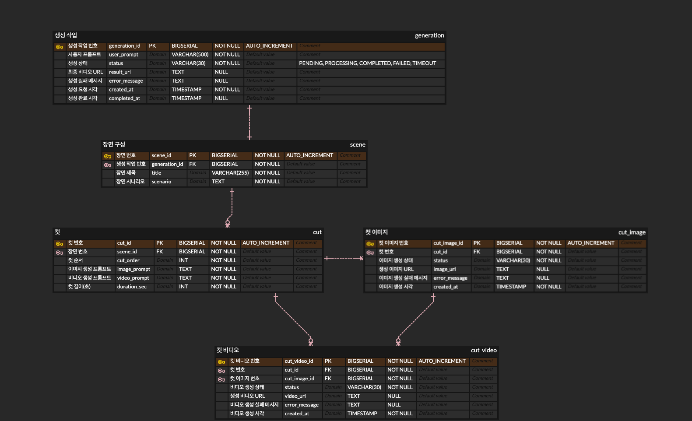

# Prompt-to-Animation Generator

사용자의 자연어 프롬프트를 입력받아 Scene → Cut → Image → Video 단계를 거쳐 최종 애니메이션을 생성하는 서비스입니다.

---

## 실행 방법

루트 디렉토리에 `.env` 파일을 생성합니다.

```
OPENAI_API_KEY=your_openai_api_key_here
KIE_API_KEY=your_kie_api_key_here
MOCK_MODE=false
```

컨테이너를 빌드하고 실행합니다.

```bash
docker compose up --build
```

| 서비스 | URL |
|--------|-----|
| Frontend | http://localhost |
| Backend | http://localhost:8080 |

---

## 환경변수 목록

| 변수명 | 필수 | 설명 |
|--------|------|------|
| `OPENAI_API_KEY` | Y | OpenAI API 키 |
| `KIE_API_KEY` | Y | Kie API 키 |
| `MOCK_MODE` | N | `true`로 설정하면 외부 API 호출 없이 더미 데이터로 워크플로우 실행 (기본값: `false`) |

---

## 설계 설명

### 아키텍처

**Layered Architecture**

```
controller → service → repository → domain
```

외부 연동은 `client` 패키지에서 담당하며, 설정은 `config`, 예외는 `exception` 패키지로 분리됩니다.

**Frontend**

React 19 + TypeScript + Vite로 구성된 SPA입니다. TanStack Query로 서버 상태를 관리하며, 폴링 방식으로 생성 진행 상태를 실시간으로 표시합니다. Nginx가 정적 파일을 제공하고 `/api` 요청을 백엔드로 프록시합니다.

### 도메인 모델



```
Generation (1) ── (1) Scene
Scene     (1) ── (N) Cut
Cut       (1) ── (N) CutImage
Cut       (1) ── (N) CutVideo
```

- **Generation**: 애니메이션 생성 요청의 최상위 단위. 전체 진행 상태(`PENDING → PROCESSING → COMPLETED / FAILED / TIMEOUT`)를 추적합니다.
- **Scene**: OpenAI가 프롬프트를 분석해 생성한 스토리 정보(제목, 시나리오, 스타일, 컷 목록).
- **Cut**: Scene을 구성하는 컷 단위. 순서(`cutOrder`)와 재생 시간(`durationSec`)을 갖습니다.
- **CutImage**: Kie Nano Banana로 생성한 컷별 이미지.
- **CutVideo**: Kie Kling-2.6으로 생성한 컷별 영상. 최종 병합의 입력으로 사용됩니다.

### 생성 워크플로우

```
1. POST /api/generations 수신 → Generation PENDING 상태로 저장 → ID 즉시 반환
2. TransactionalEventListener가 GenerationCreatedEvent를 수신 → 비동기 워크플로우 시작
3. Generation → PROCESSING
4. OpenAI GPT-5.4 mini로 Scene 및 Cut 생성 (최대 3회 재시도)
5. Kie Nano Banana로 Cut별 이미지 생성 (최대 3회 재시도, 모두 실패 시 해당 컷만 FAILED — 나머지 계속 처리)
6. Kie Kling-2.6으로 Cut별 영상 생성 (최대 3회 재시도, COMPLETED 이미지가 없는 컷은 FAILED CutVideo 저장)
7. 완성된 영상들을 FFmpeg으로 병합
8. resultUrl 저장 → Generation COMPLETED
9. 중간 오류 발생 시 Generation FAILED / TIMEOUT으로 변경
```

`durationSec`은 OpenAI 응답값을 그대로 사용하지 않고 `≤ 7초 → 5초`, `> 7초 → 10초`로 클램핑합니다 (Kie API 지원 범위).

### 공통 응답 형식

```json
// 성공
{ "success": true, "message": "요청 처리 성공", "errorCode": null, "data": {} }

// 실패
{ "success": false, "message": "에러 메시지", "errorCode": "ERROR_CODE", "data": null }
```

모든 예외는 `GlobalExceptionHandler`에서 일괄 처리합니다.

### Mock 모드

`MOCK_MODE=true` 설정 시 OpenAI·Kie API를 호출하지 않고 미리 정의된 더미 데이터와 샘플 영상 URL을 반환합니다. API 키 없이 전체 워크플로우를 검증할 수 있습니다.

---

## 테스트 및 검증 방법

### 테스트 실행

```bash
cd backend

# 전체 테스트
./gradlew test

# 레이어별 실행
./gradlew test --tests "*.domain.*"      # 도메인 단위 테스트
./gradlew test --tests "*.service.*"     # 서비스 단위 테스트 (Mockito)
./gradlew test --tests "*.repository.*"  # Repository 슬라이스 테스트 (H2)
./gradlew test --tests "*.util.*"        # 유틸 단위 테스트
```

### 테스트 구조

```
src/test/java/org/sieun/prompt2animation/
├── fixture/
│   └── TestFixtures.java                    — 공통 픽스처 팩토리
├── domain/
│   └── GenerationTest.java                  — Generation 상태 전이 (순수 단위)
├── util/
│   └── RetryUtilTest.java                   — 재시도 로직 (순수 단위)
├── service/
│   ├── GenerationServiceTest.java           — 레이트 리밋, 진행률, 상태 가드
│   ├── GenerationWorkflowProcessorTest.java — 워크플로우 단계별 분기 (Mockito)
│   └── VideoMergeServiceTest.java           — Mock 모드 병합 경로
└── repository/
    ├── GenerationRepositoryTest.java        — 레이트 리밋 쿼리
    ├── CutRepositoryTest.java               — COALESCE, 정렬 쿼리
    ├── CutImageRepositoryTest.java          — JPQL enum 리터럴, 썸네일 쿼리
    └── CutVideoRepositoryTest.java          — 최신 영상 조회 쿼리
```

- **Layer 1** (domain, util): Spring 없이 JVM만 사용.
- **Layer 2** (service): `@ExtendWith(MockitoExtension.class)`. 외부 API·DB 없이 Mockito로 대체.
- **Layer 3** (repository): `@DataJpaTest` + H2 인메모리 DB. 커스텀 JPQL 쿼리를 실제 DB에서 검증.

### Mock 모드로 전체 흐름 검증

`.env`에서 `MOCK_MODE=true`로 설정 후 실행합니다.

```bash
# 생성 요청
curl -X POST http://localhost/api/generations \
  -H "Content-Type: application/json" \
  -d '{"userPrompt": "숲 속에서 곰이 꿀을 먹는 애니메이션"}'

# 상태 폴링 (반환된 generationId로 교체)
curl http://localhost/api/generations/1

# 결과 조회
curl http://localhost/api/generations/1/result
```

### 문서

| 문서 | 설명 |
|------|------|
| [API 명세](docs/api-spec.md) | 전체 엔드포인트, 요청/응답 스펙, 에러 코드 |
| [ERD](docs/erd.md) | 엔티티 관계 및 컬럼 상세 |
| [워크플로우](docs/workflow.md) | 생성 단계별 처리 흐름 및 예외 처리 |
